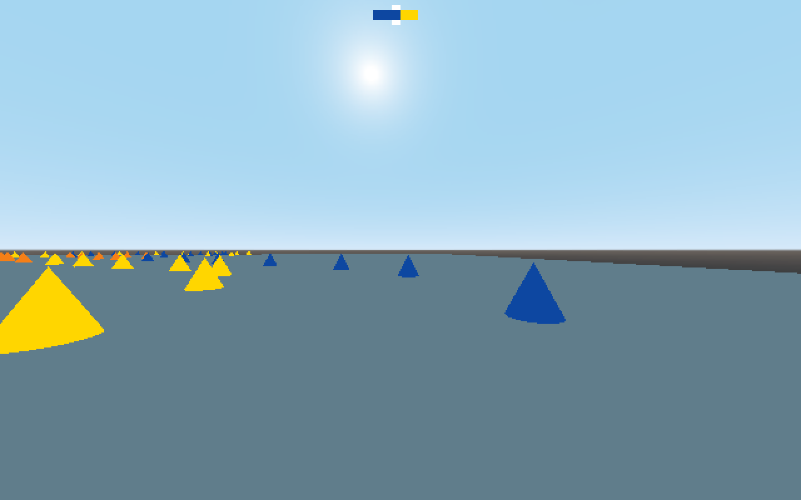

# Crashcourse

Self driving car simulation using Godot engine

Clone the repo and import the 'project.godot' file using Godot 3.1 or later.

The automatic steering is dependent on the aspect ratio of the window. Setting the window size to half a 16:9 screen should make it work with the current parameters.
